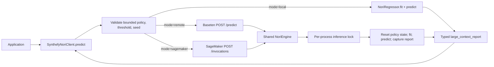

# Client and hosted large-context serving

Status: accepted for the PR 371 stacked integration

Library dependency: https://github.com/Synthefy/synthefy-nori-internal/pull/371

Review: https://github.com/Synthefy/synthefy-nori-internal/pull/371#issuecomment-5283079507

## Decision

Expose the PR 371 large-context path through `SynthefyNoriClient` in local,
Baseten remote, and SageMaker modes. The shared client/wire contract is a
bounded subset of the direct `NoriRegressor` research API:

- `random`: at most one internal Nori call;
- `cluster_route`: at most eight internal calls;
- `cluster_route_g4`: at most four internal calls.

The threshold is bounded to 1 through 10,000,000 rows and the deterministic
seed to 0 through 2**32 - 1. Callables, import/file paths, parameter strings,
holdout gates, boosting policies, and `large_context_cache_entries` do not
cross a shared network boundary.

Every client call is one-shot and supplies `X_train` again. Local mode uses a
client-owned estimator for API compatibility, but calls `fit` again and fixes
`large_context_cache_entries=1`; hosted serving does the same under its
inference lock. Neither path creates a hidden upload-once or cross-request
customer-context cache.

The response includes a typed `large_context_report` whenever a policy was
requested, even below the threshold. The client fails closed if that report is
missing or its policy, threshold, or seed does not match. This prevents an
older deployment from silently ignoring a new request field and returning an
ordinary prediction that looks valid.

The serving schema owns an equivalent lightweight wire model instead of
importing it from the installed `synthefy` artifact. This preserves server
startup with the supported released client, which predates these additive
types. Candidate-client and generated-OpenAPI tests enforce parity between the
two mirrors.

Snowflake SPCS retains its positional four-value row contract and rejects a
fifth options value. Supporting the policy there requires a versioned protocol
extension. Nori Thinking and distribution outputs are rejected before
inference because this release combines only point predictions.

## Concurrency and isolation

The shared serving estimator is mutable. Policy assignment, fit, predict, and
both memory and large-context report capture therefore occur under the same
lock. Every request re-declares policy, threshold, seed, and cache entries,
including resetting the policy to `None` for an ordinary request. Tests cover
concurrent requests and the narrow lock-release overwrite boundary.

## Deployment and billing gate

Baseten and SageMaker use the same engine and generated OpenAPI contract.
Development deployment must measure latency and GPU cost for all three
policies. Production enablement remains blocked on an explicit decision to
absorb, restrict, or price the internal-call multiplier; the existing gateway
`usage` object is unchanged and `nori_calls` is observability, not billing.

An upload-once/query-many service is a separate architecture: it needs tenant
authentication, storage and routing, TTL cleanup, capacity limits, and billing.
It is not emulated with process-local caching in this release.

## Validation

The client suite covers local, Baseten, and SageMaker parity, default wire
omission, invalid controls, capability mismatch, stale-report clearing, and
one-shot estimator behavior. Serving tests cover state reset, concurrency,
report capture, Thinking/distribution rejection, SPCS rejection, generated
OpenAPI drift, and shared container cases. The client snapshot provenance
manifest records all imported-source transformations under this decision.
